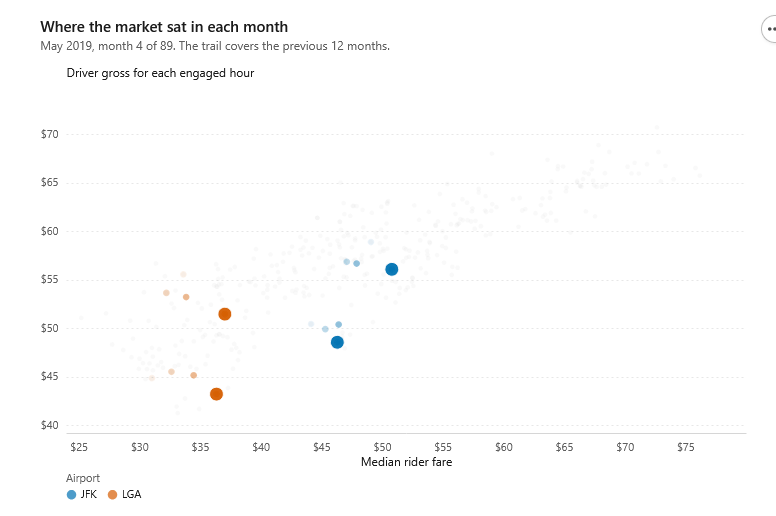
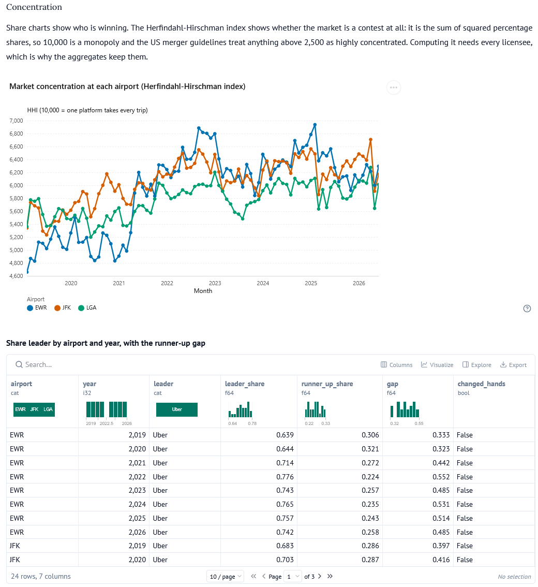
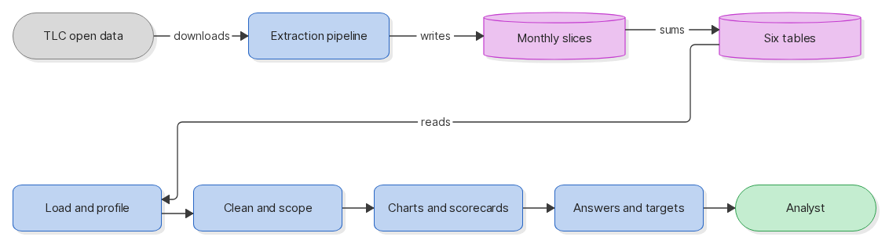
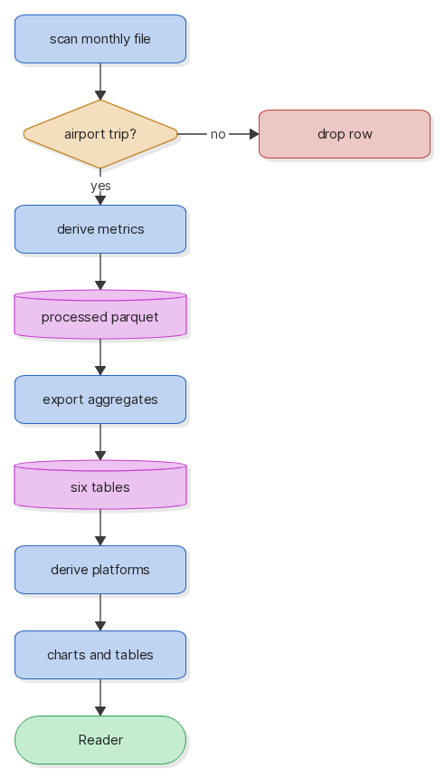
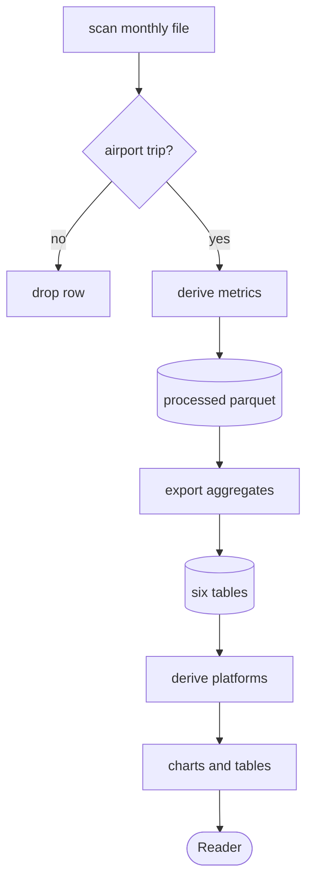

# NYC airport ride-hail

Anyone who wants to know how the airport ride-hail market in New York City (NYC) really works runs into the same wall: the regulator publishes about 40 gigabytes of raw trip records, and nobody publishes an airport summary. This project turns those records into an interactive notebook. It keeps the 122,806,218 trips that touch John F. Kennedy International Airport (JFK), LaGuardia Airport (LGA) or Newark Liberty International Airport (EWR) between February 2019 and June 2026, and it answers the market questions from the trips themselves rather than from a press release.

One marimo notebook holds the whole pipeline: the download, the transform, the
storage layer, the analysis and the conclusions.

You can see the static html site here: https://nyc-rideshare-static.omar-irfan.workers.dev/

## What the data says

- **Riders pay more, drivers keep less.** The median airport fare rose 52.1%
  across the archive while the median driver gross rose 34.3%. Payout share fell
  from 69.7% to 63.9%. Median trip distance barely moved, so trip mix does not
  explain the gap.
- **Paying drivers more did not buy market share.** Lyft's payout share overtook
  Uber's at JFK in 2023 and has stayed above it, while Lyft's share of trips
  fell. That points away from pay as the binding constraint and toward matching,
  dispatch and curb operations.
- **The two airports are different products.** Over the last ten months, Uber's
  median fare at LaGuardia runs $7.45 above Lyft's on an identical 9.5-mile
  median, a 15.3% gap. At JFK the gap is 3.5% and runs the other way. A single
  network-wide target misreads one of them.
- **A reporting rule, not a product change.** On-scene coverage for one platform
  goes from 0.16% in February 2025 to 85.6% in March and 100% in April. TLC's
  Wait Time Restrictions rule took effect on 6 March 2025. Curb wait is only
  comparable from that month.
- **Driver pay above rider payment is the minimum-pay floor**, not incentive
  spend. New York's formula pays by mile and minute divided by a utilization
  rate, independent of the fare, so on low-fare airport trips the floor lands
  above what the rider paid.
- **Two questions the data cannot answer.** There is no driver identifier, so no
  segmentation. There are no cancelled trips, so no cancellation rate. Section 8
  says so rather than building a proxy.


## Demo
 

 



## Quick start

```bash
uv run marimo edit nyc_airports.py
```

The notebook carries PEP 723 inline metadata, so `uv` builds the environment
from the file itself. Without `uv`:

```bash
pip install -e ".[dev]"
marimo edit nyc_airports.py
```


## Libraries used
 
- [altair](https://github.com/vega/altair) - every chart, through one registered theme.
- [marimo](https://github.com/marimo-team/marimo) - the reactive notebook this file runs in.
- [orjson](https://github.com/ijl/orjson) - reads and writes the cached download headers.
- [polars](https://github.com/pola-rs/polars) - every scan, filter and aggregate.
- [pygwalker](https://github.com/Kanaries/pygwalker) - the drag-and-drop exploration views.
- [requests](https://github.com/psf/requests) - downloads one monthly file at a time.
### Dev tooling
 
- [bandit](https://github.com/PyCQA/bandit) - security linting.
- [commitizen](https://github.com/commitizen-tools/commitizen) - conventional commit enforcement.
- [pre-commit](https://github.com/pre-commit/pre-commit) - git hook runner.
- [pyright](https://github.com/microsoft/pyright) - static type checking.
- [ruff](https://github.com/astral-sh/ruff) - linting and formatting.
- [yamlfix](https://github.com/lyz-code/yamlfix) - configuration file formatting.
- [yamllint](https://github.com/adrienverge/yamllint) - configuration file linting.


## Diagram
 
### System view
 
The New York City Taxi and Limousine Commission (TLC) publishes one
[Apache Parquet](https://parquet.apache.org) file for each month on a public
host. The pipeline downloads a month, keeps the airport trips, writes a slice,
and deletes the download. Six small tables come out of the slices, and the four
blue boxes on the second row are what the notebook does with them.
 
- **Load and profile** reads the six tables and one month at trip level, then
  profiles every numeric column and groups the raw month as it stands. That
  first grouping is wrong in four ways, and the notebook shows it wrong on
  purpose.
- **Clean and scope** counts the invalid rows, measures how much of each
  platform's filing carries a driver-arrival time, and then derives its own
  scope: which licensees still trade, and which airports take a dispatched
  pickup. Neither list is hard-coded.
- **Charts and scorecards** runs the whole 89-month archive. Volume and season,
  platform entry and exit, concentration, the hourly shape of each airport,
  driver pay against rider fare, and the head-to-head table for the two live
  platforms.
- **Answers and targets** turns that into the five questions below, with a
  target for each measurement set at the best value any live platform reaches
  now.
<picture>
  <source media="(prefers-color-scheme: dark)" srcset="docs/system-dark.png">
  
</picture>
<details>
<summary>Mermaid source</summary>
  

 
</details>


### Component view
 
Inside one month, the filter runs at scan time so that about 18 million rows
become about 1.5 million before anything reaches memory. The surviving rows get
the derived timing, money and flag columns. The notebook then derives which
platforms and which airports it may compare, and draws the charts from that.
 
<picture>
  <source media="(prefers-color-scheme: dark)" srcset="docs/component-dark.png">
  
</picture>
<details>
<summary>Mermaid source</summary>
  

 
</details>


## Getting the data

Section 0.10 has a button that fetches the archive and builds the aggregates.
Defaults to the full history: 89 monthly files, about 40 GB of download. One raw
file exists on disk at a time — fetch, filter, write, delete — so peak disk is
about 450 MB plus 36 MB per month kept. Interrupting is safe; completed months
are skipped on the next run.

If you already have the six aggregate tables, drop them in `data/exports/` and
the notebook loads them without downloading anything. They total 164 KB.

Section 2 also loads one month at trip level to demonstrate the cleaning. That
needs `data/processed/airport_2025-01.parquet`, which the extraction produces.

## The five questions
 
The notebook exists to answer five questions. Section 8 computes each answer for
whichever platform the selector holds, so the numbers below are one reading of
it: Uber and Lyft, airport pickups only, JFK and LaGuardia, over the ten months
from September 2025 to June 2026. Two of the five have no answer in this data.
The section says so and names the missing field, because a proxy that looks like
an answer is worse than a gap.
 
### 1. How to set pricing and earnings for airport rides
 
| Measurement | JFK Uber | JFK Lyft | LGA Uber | LGA Lyft |
|---|---|---|---|---|
| Median rider fare | $68.08 | $70.53 | $56.26 | $48.81 |
| Rider fare per mile | $4.29 | $4.18 | $5.47 | $4.90 |
| Median driver gross | $57.82 | $58.99 | $43.82 | $39.36 |
| Driver gross over rider payment | 67.0% | 67.6% | 60.1% | 62.7% |
| Driver gross per engaged hour | $65.01 | $66.86 | $62.16 | $60.90 |
| Minimum-pay binding rate | 4.0% | 2.2% | 2.6% | 1.3% |
 
Read the rows across, not down. Fare per mile runs $4.18 to $4.29 at JFK and
$4.90 to $5.47 at LaGuardia, so the airports differ by more than the platforms
do at either airport. Price each one as its own market.
 
The driver side is not set by a pricing team alone. The NYC minimum-pay standard
computes a floor for each trip from the miles, the minutes and the utilization
rate, and the fare has no part in that formula. The binding rate is the share of
pickups where that floor pays more than the rider paid in total. Where it is
high, regulation sets the price of supply. The archive also holds the ceiling
case: Juno paid a median 79.7% of the rider payment and stopped trading in 2021.
 
**What this data cannot give.** No surge multiplier, no rider-side experiment,
no bonus ledger and no cost line. Inside a platform, model the gap between the
fare-derived pay and the formula floor on each trip, then measure the share of
airport supply the floor holds.
 
### 2. Which driver segment grows airport supply, and how bonuses interact
 
**Not answerable from this data.** The trip file carries no driver identifier,
no tenure, no home borough and no bonus record. Any segment described from it is
an invention.
 
What the file does give is supply by hour. The hours from midnight to 05:00
carry 11.2% of Uber's JFK pickups and 12.7% of Lyft's, against 5.3% and 7.4% at
LaGuardia. Those are also the hours where the pay floor binds hardest: Uber's
binding rate at LaGuardia peaks at 9.3% in the 01:00 hour against 2.6% across
the whole day. Supply is hardest to hold overnight, which is where a bonus
lands.
 
A bonus and the pay floor also pay for the same thing here, and this data cannot
separate them, because both show up as driver gross above rider payment. Read
the binding rate as the floor, since the formula produces that result with no
bonus at all.
 
**What to instrument.** Driver identifier, tenure band, acceptance rate, and
bonus payments as their own field. Then segment on what share of a driver's week
is airport work, and test a bonus against the hours above.
 
### 3. Which airports underperform, on which measurements, against what targets
 
Set every target at the best value another live platform reaches now, at the
same airport, in the same window, under the same regulation and the same
weather. A target set that way is demonstrated rather than aspirational.
 
On that basis Lyft holds the JFK targets for driver gross, payout share, gross
per engaged hour and mean tip, and Uber trails on all four while holding the
shorter curb wait. LaGuardia splits: Uber leads on gross per engaged hour
($62.16 against $60.90) and on mean tip ($5.17 against $4.58), and trails on
payout share by 2.6 points.
 
Rank the airports by the size of the gaps rather than the level of the
measurements, because the airports differ by more than the platforms do. One
network-wide target reads one of the two airports wrong.
 
Watch the monitoring more than the measurements. The last months of the archive
are thin while filings still arrive, so a dashboard that reads the last two
months as a trend is reporting publication lag. Compare each month against the
same month a year earlier: the seasonal swing is larger than most of the gaps in
the table.
 
### 4. What drives cancellations, who cancels, and what reduces them
 
**Not answerable at all.** Every public trip file holds completed trips only.
There is no cancelled-trip record, no rider identifier and no driver identifier.
Nothing in this dataset separates a cancellation from a trip that never
happened.
 
The nearest legal signal is unmet demand. The request-to-pickup delay is in the
file, and an arrival bank with no matching rise in pickups shows in the hourly
profile. Both point at friction. Neither is a cancellation rate.
 
**What to instrument.** A cancellation event with five fields: the timestamp,
the side that cancelled, the seconds since the request, the stated reason, and
the queue position at the airport. The queue position is the one that shows
whether the cancellation follows the wait or the fare.
 
### 5. How riders and drivers use ride modes at airports
 
Shared rides have gone from airport pickups. Uber's shared-ride request rate is
4.6% at JFK and 4.1% at LaGuardia. Lyft's is 0.03% and 0.01%, which is a closed
product rather than a small one.
 
The archive holds the counterexample. Via ran a pooling-first service and
reached a 94.7% shared-ride request rate on its JFK pickups in November 2019, so
the collapse is a product decision and not a limit on what riders will accept.
 
Curb wait is comparable between platforms only from March 2025, when the
reporting rule took effect. Uber's median airport curb wait is 46 seconds at JFK
and 35.5 seconds at LaGuardia. Lyft's is exactly 60 seconds at both, and a
median that lands on an exact minute is a sign of minute-level rounding, so read
the direction of that difference and not its size.
 
**What this data cannot give.** No premium tier, no vehicle class beyond the
wheelchair flag, and no seat count. Any mode analysis past shared against
standard needs the product tier on each trip.


## Sources

- [TLC trip record data](https://www.nyc.gov/site/tlc/about/tlc-trip-record-data.page)
- [HVFHV data dictionary](https://www.nyc.gov/assets/tlc/downloads/pdf/data_dictionary_trip_records_hvfhs.pdf)


The trip records are published by TLC as open data. This repository holds trip data from 2019 - June 2026. The extraction also downloads it from TLC's CDN at run time if required. 

## Licence

MIT for the code. The trip records carry TLC's own terms.
